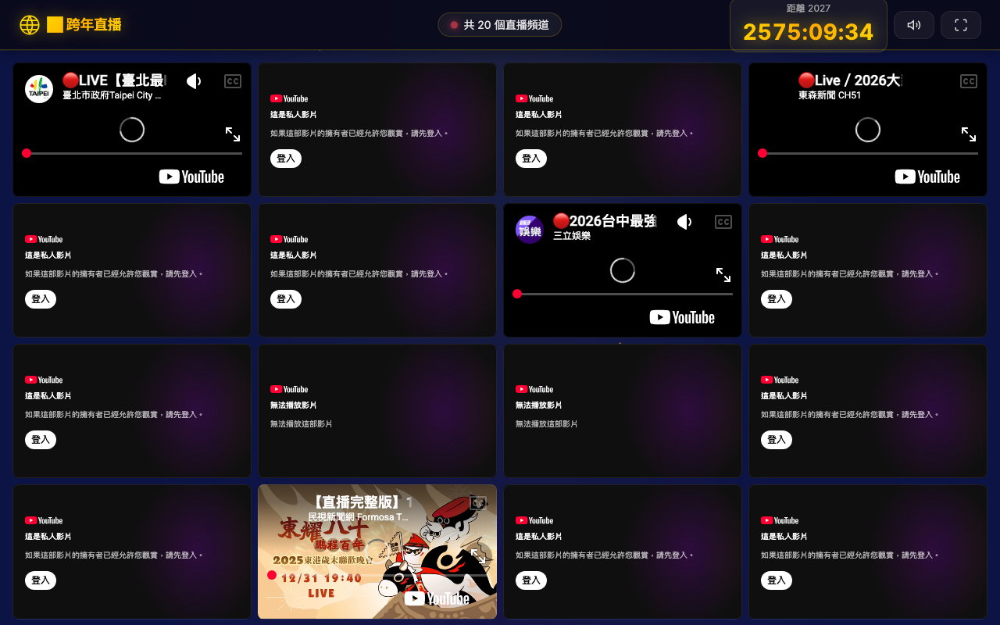

# 新年跨年直播合集 使用說明

## 這是什麼？

新年跨年直播合集是一個聚合 20 個跨年直播頻道的網頁，含倒數計時與新年煙火特效，每年跨年夜都可以重複使用。

## 使用方式

1. 跨年夜開啟網頁
2. 頁面會自動顯示倒數計時
3. 20 個直播頻道會同時顯示
4. 倒數結束時自動播放煙火特效
5. 點擊任一頻道可放大觀看

## 功能特色

- 20 個精選跨年直播頻道
- 自動計算距離下一個新年的倒數
- 跨年煙火特效動畫
- 年份自動更新，每年可重複使用
- 全螢幕直播觀看

## 注意事項

- 直播頻道網址每年需要更新（YouTube 每年建新直播）
- 同時載入 20 個影片需要良好的網路環境
- 建議使用桌機或平板觀看，手機螢幕較小
