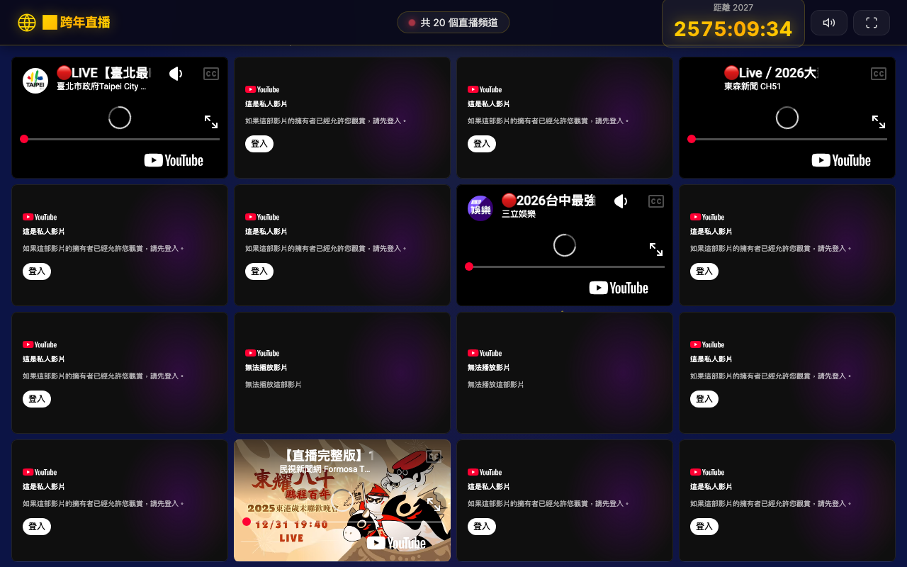

# 新年跨年直播合集 使用說明



## 這是什麼？

新年跨年直播合集是一個聚合 20 個跨年直播頻道的網頁，含倒數計時與新年煙火特效，每年跨年夜都可以重複使用。

## 使用方式

1. 跨年夜開啟網頁（或用 `?ids=` 參數帶自訂直播 ID）
2. 頁面會自動顯示倒數計時
3. 20 個直播頻道會同時顯示
4. 倒數結束時自動播放煙火特效
5. 點擊任一頻道可放大觀看

## 快捷鍵

- **F** 鍵：進入全螢幕模式
- **M** 鍵：靜音／取消靜音所有直播
- **Esc** 鍵：退出全螢幕

（不會在 input、textarea、搜尋框中觸發；不受 Cmd/Ctrl/Alt 修飾鍵影響）

## 自訂直播清單

跨年當天可用 URL 參數臨時替換直播清單，無須重新部署：
```
?ids=11碼ID1,11碼ID2,...,11碼ID20
```

範例：`https://miku4ocean.github.io/Youtube-New-Year/?ids=dQw4w9WgXcQ,MZO5XbHu_wc,...`

## 功能特色

- 20 個精選跨年直播頻道，支援快捷切換
- 自動計算距離下一個新年的倒數（超過 24 小時顯示「N 天 HH:MM:SS」）
- 跨年煙火特效動畫
- 年份自動更新，每年可重複使用
- 全螢幕直播觀看
- 單次靜音所有直播（透過 YouTube IFrame API，無須重新載入）

## 注意事項

- 直播頻道網址每年需要更新（YouTube 每年建新直播；12 月中更新 `channels.js` 或用 `?ids=` 覆蓋）
- 同時載入 20 個影片需要良好的網路環境
- 建議使用桌機或平板觀看，手機螢幕較小
- 某些瀏覽器的自動播放政策可能會擋掉 iframe，此時需手動點擊播放按鈕
